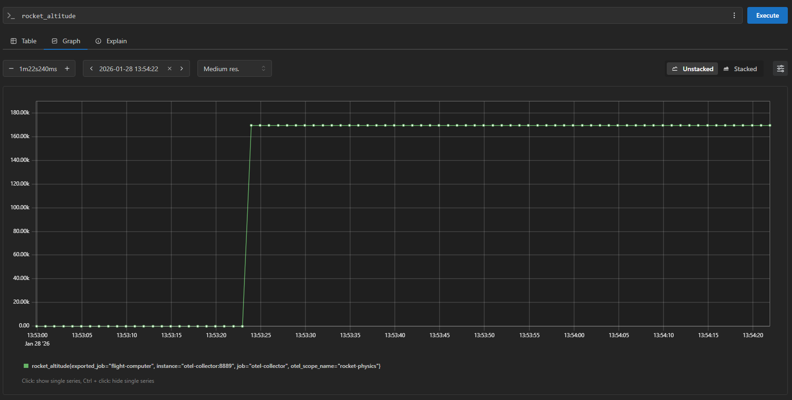

[](./LICENSE)

# Mission Lifecycle Monitor 🚀

**Mission Lifecycle Monitor** is a full-stack observability showcase project that simulates a complex rocket launch mission.

Designed to demonstrate **Operational Intelligence**, it integrates a retro-sci-fi "Glass Cockpit" dashboard with a physics-driven backend. The entire distributed system is instrumented with **OpenTelemetry**, providing deep insights through real-time distributed tracing, metrics collection, and structured logging.


## 🌐 Live Demo

You can access the hosted **Mission Control** dashboard directly here:
**[https://mission-lifecycle-monitor.guillermofy.com/](https://mission-lifecycle-monitor.guillermofy.com/)**

*   **View Only**: Observe the flight computer simulation in real-time.
*   **Note**: For full access to the observability stack (Jaeger traces, Prometheus metrics, Loki logs), please use the local Docker deployment.

## 🏗️ Architecture & Tech Stack

The project is designed as a modular distributed system to demonstrate end-to-end observability.

1.  **Mission Control (Frontend)**
    *   **Tech**: Next.js 15, React 19, Tailwind CSS, Recharts.
    *   **Role**: The "Glass Cockpit". It renders high-frequency telemetry (60fps animation) and sends command signals.
    *   **Style**: Retro-terminal aesthetic with **VT323** font and CSS animations.

2.  **Flight Computer (Backend)**
    *   **Tech**: Node.js, Express.js.
    *   **Role**: The On-Board Computer (OBC). Runs the physics simulation loop (gravity turn, orbital mechanics) and state machine.
    *   **Instrumentation**: **OpenTelemetry (Node.js SDK)** generates traces, metrics, and logs for every operation.

3.  **Ground Station (Infrastructure)**
    *   **Tech**: Docker Compose.
    *   **Observability Stack**:
        *   **OpenTelemetry Collector**: Aggregates all signals.
        *   **Prometheus**: Stores time-series metrics (Fuel, Altitude, Speed).
        *   **Jaeger**: Visualizes distributed traces (e.g., Latency of "Launch" command).
        *   **Grafana Loki**: Aggregates structured logs for anomaly detection and event playback.

---

## ✨ Key Features

*   **Realistic Physics Engine**: Simulates "Gravity Turn" mechanics, air resistance, and orbital velocity transitions.
*   **Real-time Telemetry**: 1Hz data updates for Altitude, Speed, and Fuel Status.
*   **Reactive Dashboard**: 
    *   **Animated Metrics**: Smooth number interpolation for a fluid "cockpit" feel.
    *   **Live Charts**: High-performance Area Charts utilizing Recharts with optimized rendering.
    *   **Flight Events Terminal**: A scrolling, color-coded terminal window displaying real-time system logs.
*   **Full Observability**: Every action is traced from the click in the browser to the backend logic.

---

## 📜 Flight Sequence & Events

The **Flight Computer** simulates a realistic launch timeline with specific events based on altitude and speed thresholds:

1.  **Start Sequence**: Countdown from T-10, Internal Guidance transition, Main Engine Start.
2.  **Ignition & Liftoff**: Launch detection and tower clearance.
3.  **Gravity Turn (T+ ~10s)**: Rocket begins pitching over to gain horizontal velocity.
4.  **Mach 1 (Sound Barrier)**: Vehicle transitions to supersonic flight (~1234 km/h).
5.  **Max Q (11 km)**: Maximum Dynamic Pressure region, where structural stress is highest.
6.  **Telemetry Handover (50 km)**: Comm link transitions from ground stations to TDRS satellite network.
7.  **MECO (Main Engine Cut-off) (75 km)**: First stage engine shutdown.
8.  **Stage Separation**: Separation of first stage and ignition of the second stage vacuum engine.
9.  **Fairing Separation (110 km)**: Protective nose cone deploy.
10. **Orbit Insertion (170 km)**: Target altitude reached, SECO (Second Engine Cut-off), and Systems Nominal.

---

## ⚠️ Failure Scenarios

This is not just a "happy path" demo. The system includes a **probabilistic failure engine** to demonstrate anomaly detection:

*   **Pad Abort (Start)**: 5% chance of Combustion Instability during the first 4 seconds of flight.
*   **Ascent Failures**: ~30% cumulative probability of critical failure during ascent (Turbopump Overheat or Hydraulic Pressure Loss).
*   **Manual Abort**: The user can trigger an emergency abort at any time, which logs a specific `WARNING` event.

---

## 🔍 Observability Data Analysis

The system is fully instrumented to provide a "Glass Box" view of the mission, collecting three distinct types of telemetry data.

### 1. 🕸️ Distributed Traces (Jaeger)
Every command (Launch, Abort, Reset) generates a unique **Trace ID** that propagates through the system.
*   **Goal**: Analyze latency and request flows.
*   **Visual**: A breakdown of how long the backend takes to process a "Start Mission" request.


*`POST/ Start` to `mission.launch` span.*

### 2. 📈 System Metrics (Prometheus)
The Flight Computer emits physical telemetry at 1Hz.
*   **Goal**: Monitor trend lines and resource depletion.
*   **Key Metrics**: `rocket_altitude`, `rocket_speed`, `rocket_fuel_level`.


*`rocket_altitude` graph.*

### 3. 📜 Event Logs (Loki)
Structured logs provide the narrative of the mission. The Mission Control dashboard consumes these via a "Live Tail" mechanism.

*   **Pipeline**: `Flight Computer (JSON)` -> `OTel Collector` -> `Loki` -> `Mission Control`.
*   **Format**: JSON-structured log lines.

### 📋 Event Catalog

Below is the complete reference of all events generated by the simulation:

| Event Message | Type | Trigger Condition |
| :--- | :---: | :--- |
| **Pre-Launch & Launch** | | |
| `System Reset` | `INFO` | Manual click on "Reset" button. |
| `T-Minus 1 minute` | `INFO` | Countdown reaches 60s. |
| `Guidance is internal` | `INFO` | Countdown reaches 10s. |
| `Main Engine Start Sequence` | `INFO` | Countdown reaches 6s. |
| `IGNITION! LIFTOFF! We have a liftoff.` | `SUCCESS` | Countdown reaches 0s. |
| `Tower cleared` | `INFO` | Immediately after liftoff. |
| **Ascent Phase** | | |
| `Gravity Turn Maneuver Started` | `INFO` | Altitude > 1,000 m. |
| `Vehicle is Supersonic (Mach 1)` | `INFO` | Speed > 1,234 km/h. |
| `MAX Q reached (Maximum Dynamic Pressure)` | `INFO` | Altitude > 11,000 m. |
| `Telemetry Handover to Data Relay Satellites`| `INFO` | Altitude > 50,000 m. |
| `MECO (Main Engine Cutoff) Confirmed` | `INFO` | Altitude > 75,000 m. |
| `Stage 1 Separation Confirmed` | `SUCCESS` | 2 seconds after MECO. |
| `Stage 2 Engine Ignition` | `INFO` | Immediately after Stage Separation. |
| `Fairing Separation Confirmed` | `SUCCESS` | Altitude > 110,000 m. |
| `Orbit Insertion Complete` | `SUCCESS` | Altitude reaches 170 km (Target Orbit). |
| `SECO (Second Engine Cutoff)` | `INFO` | Upon Orbit Insertion. |
| `Systems Nominal` | `SUCCESS` | Upon Orbit Insertion. |
| **Anomalies & Failures** | | |
| `Telemetry Check: Signal Nominal` | `INFO` | Random operational "heartbeat" (1% chance/tick). |
| `PROPELLANT DEPLETED BEFORE ORBIT...` | `WARNING` | Fuel reaches 0% before Orbit Insertion. |
| `CRITICAL: Combustion Instability Detected` | `ERROR` | Random failure (5% chance) during T+0 to T+4s. |
| `AUTOMATIC PAD ABORT TRIGGERED` | `ERROR` | triggered by Combustion Instability. |
| `CRITICAL: Turbopump Exhaust Temp High` | `ERROR` | Random failure (~0.15%/tick) during ascent. |
| `CRITICAL: Hydraulic Pressure Loss...` | `ERROR` | Random failure (~0.15%/tick) during ascent. |
| `AUTOMATIC ABORT SEQUENCE INITIATED` | `ERROR` | Triggered by any ascent failure. |
| `MANUAL ABORT COMMAND RECEIVED` | `WARNING` | User clicks "Abort" button. |

---

## 📋 Prerequisites

Before running the mission, ensure you have the following installed:

*   **Node.js** (v20 or higher)
*   **Docker Desktop** (Running and configured)
*   **Git**

---

## 🚀 How to Run

### Method 1: Docker Quickstart (Recommended) 🐳

The easiest way to run the mission. Requires **only Docker Desktop**. No Node.js installation needed.

1.  Open terminal in project root.
2.  Run everything (Frontend + Backend + Observability Stack):
    ```bash
    docker-compose up --build
    ```
3.  Access Mission Control at **[http://localhost:3000](http://localhost:3000)**.
    *   *Note: If port 3000 or 8080 are occupied, you may need to stop other services.*

### Method 2: Developer Mode (Hybrid)

If you want to edit code while running, use the helper scripts which run infrastructure in Docker but keep the apps running locally with Node.js.

#### Option A: Windows (PowerShell)

We have provided a comprehensive PowerShell script that orchestrates the entire startup sequence (Docker infrastructure -> Backend -> Frontend).

1.  Open PowerShell in the project root.
2.  Run the start script:
    ```powershell
    .\start-mission.ps1
    ```
3.  The script will:
    *   Spin up the Ground Station (Docker containers).
    *   Wait for services to warm up.
    *   Launch the Flight Computer in a new window.
    *   Launch Mission Control in a new window.
    *   Tell you when ready!

4.  **Graceful Shutdown**: Press any key in the main PowerShell window to stop the mission. The script will automatically:
    *   Find and close the Flight Computer window.
    *   Find and close the Mission Control window.
    *   Stop and remove all Docker containers.

#### Option B: Linux/Mac (Bash)

For Unix-based systems, we provide a Bash script equivalent:

1.  Open your terminal in the project root.
2.  Make the script executable (first run only) and run it:
    ```bash
    chmod +x start-mission.sh
    ./start-mission.sh
    ```
3.  The script runs processes in the background and saves logs to `flight-computer.log` and `mission-control.log`.
4.  **Graceful Shutdown**: Press **ENTER** in the terminal to stop all processes and cleanup Docker containers.

### Method 3: Manual Start (Legacy)

If you prefer to run things manually:

1.  **Start Ground Station (Docker)**
    ```bash
    docker-compose -f ground-station/docker-compose.yaml up -d
    ```

2.  **Start Flight Computer (Backend)**
    ```bash
    # From the project root
    npm install
    # Run with OTel instrumentation
    node --require ./flight-computer/instrumentation.js flight-computer/app.js
    ```
    *The server runs on port `8080`.*

3.  **Start Mission Control (Frontend)**
    ```bash
    cd mission-control
    npm install
    ```
    *The dashboard runs on `http://localhost:3000`.*

---

## 🎮 Usage

1.  Open your browser to **[http://localhost:3000](http://localhost:3000)**.

2.  **Status**: Typically starts in `IDLE`.
3.  **Start Mission**: Click the **"INITIATE LAUNCH SEQUENCE"** button.
    *   Observe the countdown/logs in the new **Terminal**.
    *   Watch the status change to `FLYING`.
    *   See telemetry (Code color changes for Supersonic/Hypersonic).
    *   Monitor for potential failures!
4.  **Telemetry Analysis**:
    *   Click **"SYS_TRACES"** in the Command Sequence panel to open **Jaeger**.
        *   *See "Observability" section for trace examples.*
    *   Click **"SYS_METRICS"** to open **Prometheus**.
        *   *See "Observability" section for metric graph examples.*

## 📂 Project Structure

```
Mission-Lifecycle-Monitor/
├── flight-computer/       # Backend (Node.js)
│   ├── Dockerfile         # Docker Container definition
│   ├── app.js             # Physics Engine & API
│   └── instrumentation.js # OpenTelemetry setup
├── mission-control/       # Frontend (Next.js)
│   ├── Dockerfile         # Docker Container definition
│   ├── app/               # React Code
│   └── components/        # Dashboard Widgets
├── ground-station/        # Observability Configs
│   └── *.yaml             # Prometheus, Loki, OTel Configs
├── docs/
│   └── assets/            # Screenshots & Diagrams
├── docker-compose.yml     # Docker Root Compose (Runs everything)
├── start-mission.ps1      # Developer Script (Windows)
├── start-mission.sh       # Developer Script (Linux/Mac)
└── package.json           # Root dependencies
```

## License
Distrubuted under the MIT License. See `LICENSE` for more information.

---

> Built with 💻 and 🚀 by Guillermo Fuentes Yago as a demonstration of Modern Observability Engineering.
