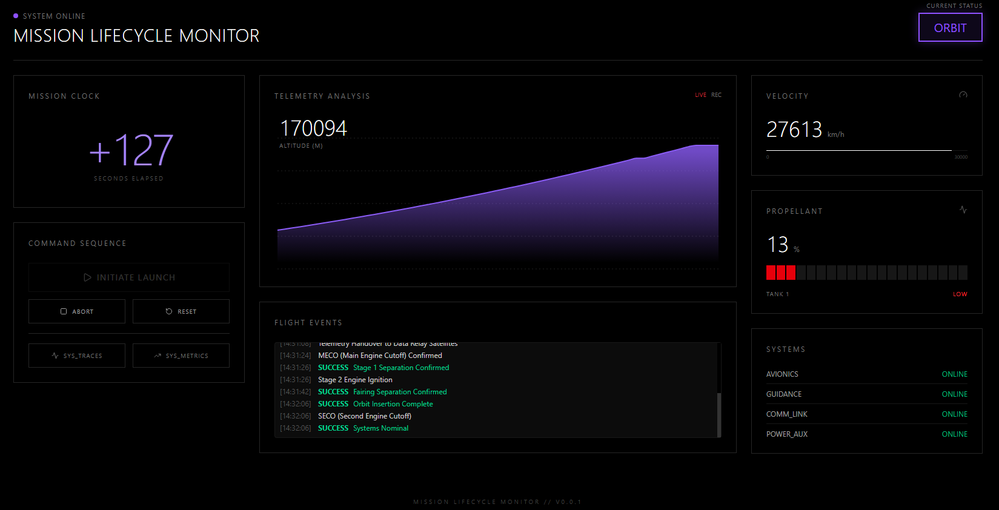

# Mission Lifecycle Monitor 🚀

**Mission Lifecycle Monitor** is a full-stack observability demonstration project that simulates a rocket launch mission. It integrates a retro-sci-fi "Mission Control" dashboard with a backend "Flight Computer" that generates real-time physics telemetry. The entire system is instrumented with **OpenTelemetry** to demonstrate end-to-end distributed tracing, metrics collection, and system monitoring.

 *<!-- Add a screenshot here later -->*

## 🏗️ Architecture

The project consists of three main subsystems:

1.  **Mission Control (Frontend)**:
    *   A **Next.js** application acting as the command center.
    *   Displays real-time telemetry (Altitude, Speed, Fuel, Status).
    *   Provides mission controls (Launch, Abort, Reset).
    *   Styled with a retro-terminal aesthetic using **Tailwind CSS** and the **VT323** font.

2.  **Flight Computer (Backend)**:
    *   A **Node.js/Express** service acting as the rocket's On-Board Computer (OBC).
    *   Simulates physics (acceleration, fuel burn, orbital mechanics).
    *   Instrumented with **OpenTelemetry** to emit traces and metrics for every event and state change.

3.  **Ground Station (Infrastructure)**:
    *   A **Docker Compose** stack hosting the observability backend.
    *   **OpenTelemetry Collector**: Aggregates data from the Flight Computer.
    *   **Prometheus**: Stores time-series metrics (Fuel levels, Speed).
    *   **Jaeger**: Visualizes distributed traces (Launch sequence transactions).
    *   **Loki**: Log aggregation.
    *   **Grafana**: (Optional) Analysis of telemetry data.

---

## 🛠️ Tech Stack

*   **Frontend**: Next.js 15, React 19, Tailwind CSS, Lucide Icons, Tremor/Recharts.
*   **Backend**: Node.js, Express.js.
*   **Observability**: OpenTelemetry (Node.js SDK), Docker, Prometheus, Jaeger, Grafana.
*   **Automation**: PowerShell scripting.

---

## 📋 Prerequisites

Before running the mission, ensure you have the following installed:

*   **Node.js** (v20 or higher)
*   **Docker Desktop** (Running and configured)
*   **Git**

---

## 🚀 How to Run

### Method 1: The "One-Click" Launch (Windows PowerShell)

We have provided a comprehensive PowerShell script that orchestrates the entire startup sequence (Docker infrastructure -> Backend -> Frontend).

1.  Open PowerShell in the project root.
2.  Run the start script:
    ```powershell
    .\start-mission.ps1
    ```
3.  The script will:
    *   Spin up the Ground Station (Docker containers).
    *   Wait for services to warm up.
    *   Launch the Flight Computer in a new window.
    *   Launch Mission Control in a new window.
    *   Tell you when ready!

### Method 2: Manual Start

If you prefer to run things manually or are on a non-Windows system:

1.  **Start Ground Station (Docker)**
    ```bash
    docker-compose -f ground-station/docker-compose.yaml up -d
    ```

2.  **Start Flight Computer (Backend)**
    ```bash
    # From the project root
    npm install
    # Run with OTel instrumentation
    node --require ./flight-computer/instrumentation.js flight-computer/app.js
    ```
    *The server runs on port `8080`.*

3.  **Start Mission Control (Frontend)**
    ```bash
    cd mission-control
    npm install
    npm run dev
    ```
    *The dashboard runs on `http://localhost:3001`.*

---

## 🎮 Usage

1.  Open your browser to **[http://localhost:3001](http://localhost:3001)**.
2.  **Status**: Typically starts in `IDLE`.
3.  **Start Mission**: Click the **"INITIATE LAUNCH SEQUENCE"** button.
    *   Observe the countdown.
    *   Watch the status change to `FLYING`.
    *   See telemetry (Altitude, Speed) increase and Fuel decrease.
4.  **Abort**: If things go wrong, hit **"ABORT MISSION"**.
5.  **Telemetry**:
    *   You can view the raw metrics in **Prometheus** (usually `http://localhost:9090`).
    *   You can view the traces of your commands in **Jaeger** (usually `http://localhost:16686`).

## 📂 Project Structure

```
Mission-Lifecycle-Monitor/
├── flight-computer/       # Node.js Backend & Physics Engine
│   ├── app.js             # Main simulation logic & API
│   └── instrumentation.js # OpenTelemetry SDK setup
├── mission-control/       # Next.js Frontend Dashboard
│   ├── app/               # React components & Pages
│   └── components/        # Dashboard UI widgets
├── ground-station/        # Infrastructure
│   ├── docker-compose.yaml
│   └── *.yaml             # Configs for Prometheus, OTel, etc.
├── start-mission.ps1      # Orchestration Script
└── package.json           # Root dependencies
```

## License

This project is for educational and demonstration purposes.
